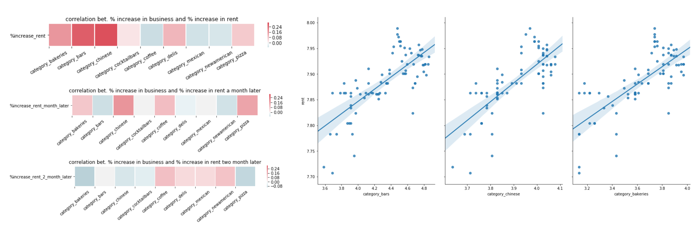
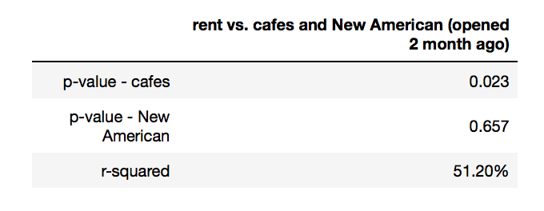
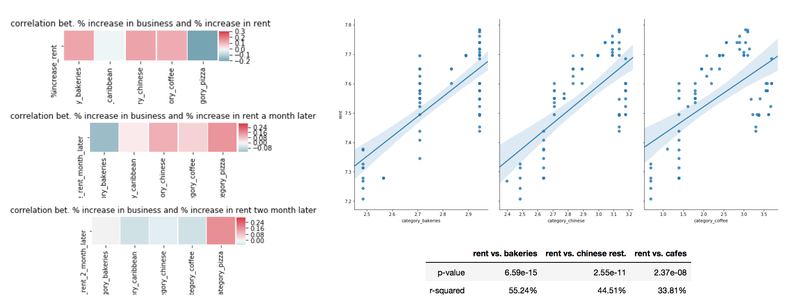

# Forecasting/Predicting Gentrification in NYC Area with Yelp Data 
## Project Scope

Yelp is a great platform to obtain real-time data which could help us understand the socio-economic changes in neighborhoods. In the first part of the study, housing price was used as the measure of neighborhood change and see if the change in businesses correlates to the increase and decrease in housing prices in the metropolitan area in NY. In the second part, gentrification in NYC is predicted using Yelp data, combined with other demographic measures from the 2016 Census.

## Procedure and Project Overview
1) Collecting the data  
**Data Sources:** <a href="https://www.zillow.com/research/data/">Zillow</a>, <a href="https://www.yelp.com/developers">Yelp API</a>, and <a href="https://www.census.gov/acs/www/data/data-tables-and-tools/data-profiles/2016/">American Community Survey, Census 2016</a>
<UL>
<LI>Median studio price data by zip code in NYC area was obtained from Zillow (this project focuses on the studio rental prices with the assumption that gentrifying area tends to attract younger generations).
<LI>Yelp data (up to 1,000 businesses for each zip code in NYC are) was obtained using Yelp API.
<LI>Demographic data, including education level, racial diversity of the neighborhood, income level, was obtained from the American Community Survey, Census 2016 (by zip code level as well). </UL>

2) Data Cleaning and EDA  
<i>- How were the missing values treated?</i>
     
        <b>Rent:</b> 
        Median studio rent data from Zillow has monthly rent values from March 2010 to September 2018. However, it had a lot of missing values, especially before November 2011; hence, values before November 2011 have been omitted.
         
        <b>Yelp:</b>
         
        Mean values were used in place of the missing values.
          
        <i>Please refer to the below result section for more details.</i>

3) Using Linear Regression to Study the Correlation between Business Growth and Rent Increase

4) Using Time Series Analysis to Predict Future Rent

5) Using Machine Learning Classification Algorithms to Detect Gentrification

## Results
### Visualising the Changes in NYC Neighborhoods

 
 
 
 
 
The map on the left shows how the rent (median studio rent by zip code) has been increasing in the NYC area since November 2011 to August 2018.  
Since the median studio rent data from Zillow has a lot of missing values, especially for the earlier dates, the map is not complete (grey areas designate the missing values).  Regardless of the missing data, it is still clear that the colors in certain areas intensify as we fast forward the time. 
 
 
 
 
 
 
 
 
 
- Median studio rent in Manhattan, Queens, Brooklyn, and Bronx has increased by <b>21.04%</b> on average from November 2011 to August 2018.  
- Roughly <b>38.71%</b> of NYC neighborhoods (zip code level) have experienced above mean ( > 21.04%) rent increase.
 
 

 
The figure on the right shows the lists of NYC neighorhoods with the fastest and slowest rent increases.
  While we are aware that the rent has been increasing more in certain areas, the next step would be to determine if there have been any changes to the businesses in these areas as well.       
<h3> Business Changes in the Areas with the Fastest and Slowest Rent Increase </h3>

Figures on the right show the cumulative growth (= percentage increase) of new businesses by month in the neighborhoods with faster rent increase (Williamsburg and Bushwick) and slower rent increase (East Harlem and Chelsea/Clinton).  
 
・ businesses seem to grow faster in the areas where the rent has been growing rapidly - the rent has increased by <b>39.37</b>% (3rd in the NYC area) in Bushwick and <b>24.00</b>% (11th) in Williamsburg, while it was <b>5.48</b>% in East Harlem (3rd slowest rent growth), and was <b>13.04</b>% in Chelsea/Clinton.
 
<h4>Correlation between Business Growth and Rent Increase </h4>
・ as observed, both rent and businesses have been growing in these areas - we must determine whether or not increase in rent and business actually correlate to each other.

<h3>Cases of Selected Areas with High Rent Growth - Williamsburg and Bushwick</h3>

 
Figures on the left show the top 10 fastest-growing businesses in Williamsburg and and the top 5 fastest-growing in Bushwick (cumulative sum over time). Bars in Williamsburg and Cafes in Bushwick grew faster than the other types of businesses.  
   
<h3>Using Business Growth to Predict Rent</h3>
<h4>Williamsburg</h4>

     
p-values are all far less than 0.05. 
・ we can reject the null hypothesis that there is no relationship between these parameters and rent. 
・ we can conclude that there is some correlation between the # of bars/Chinese restaurants/bakeries and studio rent.  
Looking at r-squares, the Chinese restaurant model performed the best. 
<h4>Bushwick</h4>

<h3>Predicting the Future Rent with Time Series Analysis</h3>
<b>Now that we saw that there is some correlation between business growth and rent increase, time series analysis will be used to predict future rent?</b>
 
・ as the rent varies area-by-area, I have decided to focus only on Williamsburg as an example.  
・ used number of bars as exogenous parameter of the ARIMAX model.

<h3>Detecting Gentrification using Machine Learning Algorithms</h3>
<b>Only Williamsburg and Bushwick have been examined in depth so far - could this be generalized and applied across the entire NYC area? </b> 
Machine learning algorithms are used to detect if the area is: 
<b>・ Gentrifying:</b> the area that was low-income in 1990 and experienced rent growth above the median SBA rent growth between 1990 and 2010-2014 
<UL>
<LI><b>Non-gentrifying:</b> the areas that started off as low-income in 1990 but experienced more modest growth 
<LI><b>Higher-income:</b> the areas that had higher incomes in 1990 
<LI>for classification, Yelp data was combined with demographic data from the 2016 Census 
    </UL>

           
Random Forest classifier performed the best overall; however, it performed questionably well, possibly because there was data leakage:  
・ Gentrification was classified based on "income" and "rent". 
・ Demographic parameters like education level could be highly correlated to these. 
・ If the number of cafes and bars actually correlates to the rent price, it could also cause data leakage. 
 
<b>Next Steps</b> 
・Determine if we generalize the regression model as well? 
・Use these parameters above and machine learning models (Decision Tree Regression) to predict housing prices.
