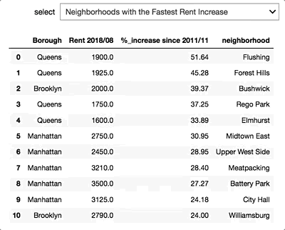
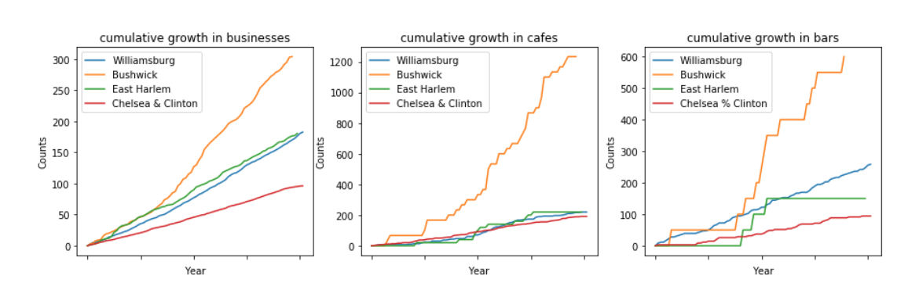
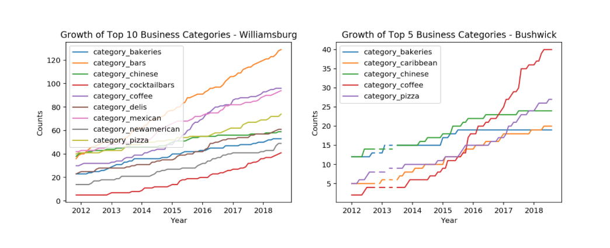
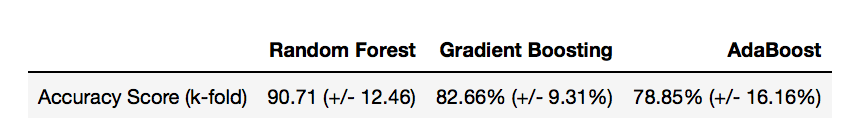
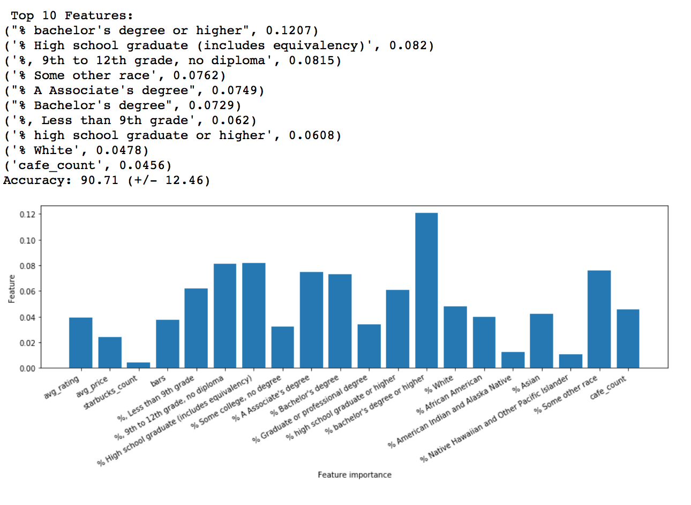
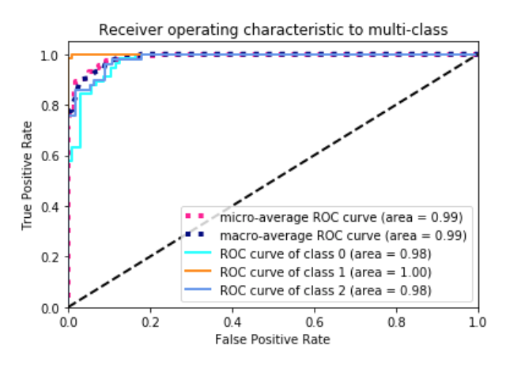

# Forecasting/Predicting Gentrification in NYC Area with Yelp Data 
## Project Scope

Yelp is a great platform to obtain real-time data which could help us understand the socio-economic changes in neighborhoods. In the first part of the study, I am going to use housing price as the measure of neighborhood change and see if the change in businesses correlates to the increase/decrease in housing prices in the metropolitan area in NY. In the second part, I am going to try predicting gentrification in NYC using Yelp data, combined with other demographic measures from 2016 Census.

## Procedure and Project Overview
1) Collecting the data  
**Data Sources:** <a href="https://www.zillow.com/research/data/">Zillow</a>, <a href="https://www.yelp.com/developers">Yelp API</a>, and <a href="https://www.census.gov/acs/www/data/data-tables-and-tools/data-profiles/2016/">American Community Survey, Census 2016</a>
- Median studio price data by zipcode in NYC area was obtained from zillow (for this project, I am going to focus on the studio rental prices with the assumption that gentrifying area tends to attract younger generations)
- Yelp data (up to 1000 businesses for each zipcode in NYC are) was obtained using Yelp API
- Demographic data, including education level, racial diversity of the neighborhood, income level, was obtained from American Community Survey, Census 2016 (by zipcode level as well). 

2) Data Cleaning and EDA  
<i>- How were the missing values treated?</i>
     
        <b>Rent:</b> 
        Median studio rent data from zillow has monthly rent values from March 2010 to September 2018. However it has a lot of missing values especially before November 2011; hence, I omitted values before November 2011.
         
        <b>Yelp</b>
         
        mean values are used for the missing values
         
        <i>Please refer to the below result section for more details.</i>

3) Using Linear Regression to Study the Correlation between business increase and rent increase

4) Using Time Series Analysis to Predict the Future Rent

5) Using Machine Learning Classification Algorithms to Detect Gentrification

## Results
### Visualising the changes in NYC neighborhoods

 
 
 
 
 
The map on the left shows how the rent (median studio rent by zipcode) has been increasing in NYC area since November 2011 to August 2018.  Since the median studio rent data from Zillow has a lot of missing values, especially for the older dates, the map is not complete (grey areas are with the missing values).  Regardless of the missing data, it is still pretty visible that the color in certain areas intensifies as we fast forward the time. 
 
 
 
 
 
 
 
 
 
- Median studio rent in Manhattan, Queens, Brooklyn, and Bronx has increased by <b>21.04%</b> in average since Nov. 2011 to Aug. 2018  
- Roughly <b>38.71%</b> of NYC neighborhood (zipcode level) have experienced above mean ( > 21.04%) rent increase
 
 

 
Figure on the right shows the lists of NYC neighorhoods with fastest and slowest rent increase.
  Now we know that the rent has been increasing a lot in certain areas - have there been business changes in these areas as well?       
<h3> Business Changes in the Areas with Fastest and Slowest Rent Increase </h3>

Figures on the right show the cumulative growth (= percentage increase) of new businesses by month in the neighborhoods with fast rent increase (Williamsburg and Bushwick) and slow rent increase (East Harlem and Chelsea/Clinton).  
 
・ businesses seem to grow faster in the areas where the rent has been growing rapidly - the rent has increased by <b>39.37</b>% (3rd in the NYC area) in Bushwick and <b>24.00</b>% (11th) in Williamsburg, while it was <b>5.48</b>% (3rd from the bottom) in East Harlem, and was <b>13.04</b>% in Chelsea/Clinton
 
<h4>Is there any correlation between business growth and rent increase?? </h4>
・ we just saw that both rent and businesses have been growing in these areas - does increase in rent and business actually correlate to each other?

<h3>Cases of the Areas with the Fast Rent Growth - Williamsburg and Bushwick</h3>

 
Figures on the left show top 10 and 5 growing businesses in Williamsburg and Bushwick (cumulative sum over time). Bars in Williamsburg and Cafes in Bushwick seem to lead the others. 
<b>Can we use this to predict the rent...?</b>
   
<h4>Williamsburg</h4>

<h4>bushwick</h4>

<h3>Predict the Future Rent with Time Series Analysis</h3>
<b>Now that we saw that there are some correlations between business growth and rent increase, can we use time series analysis to predict the future rent?</b>
 
・ as the rent varies area-by-area, I am goint to focus only on Williamsburg  
・ use number of bars as exogenous parameter of time series

<h3>Detecting Gentrification using Machine Learning Algorithms</h3>
<b>We've only looked at Williamsburg, and Bushwick, but can we generalize it to the whole NYC area?</b> 
・use machine learning algorithm to detect if the area is: 
<b>・ Gentrifying:</b> the area that was low-income in 1990 and experienced rent growth above the median SBA rent growth between 1990 and 2010-2014 
<b>・ Non-gentrifying:</b> the areas that started off as low-income in 1990 but experienced more modest growth 
<b>・ Higher-income:</b> the areas that had higher incomes in 1990. 
・ for classification, yelp data are combined with demographic data from 2016 Census 

           
Random Forest classifier performs the best overall It's performing questionably good possibly there is data leakage:  
・ gentrification is classified based on "income" and "rent" 
・ demographic parameters like education level could highly be correlated to these 
・ if number of cafes, bars etc.. actually correlates to the rent, it also could cause data leakage 
 
<b>Next Steps.....</b> 
Could we generalize the regression model as well? 
Use these parameters above and machine learning models (Decision Tree Regression) to predict the housing prices
